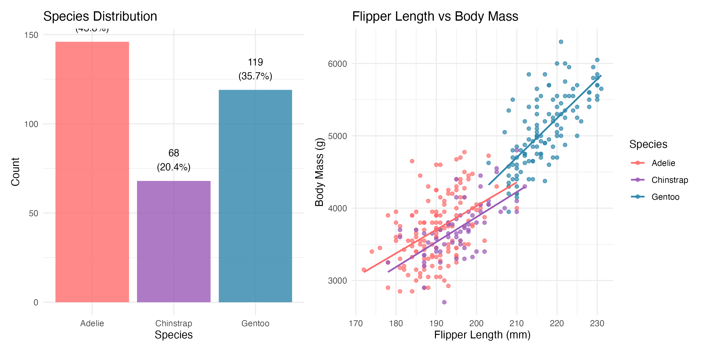
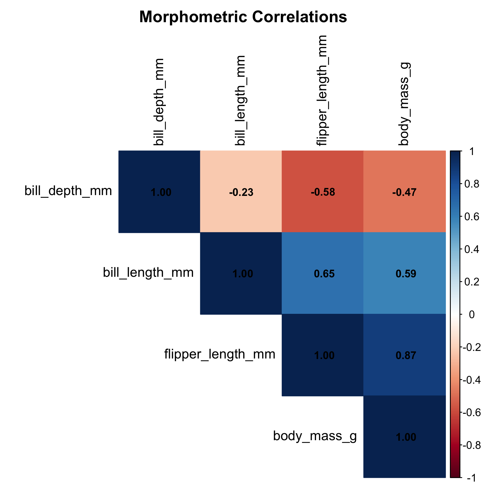
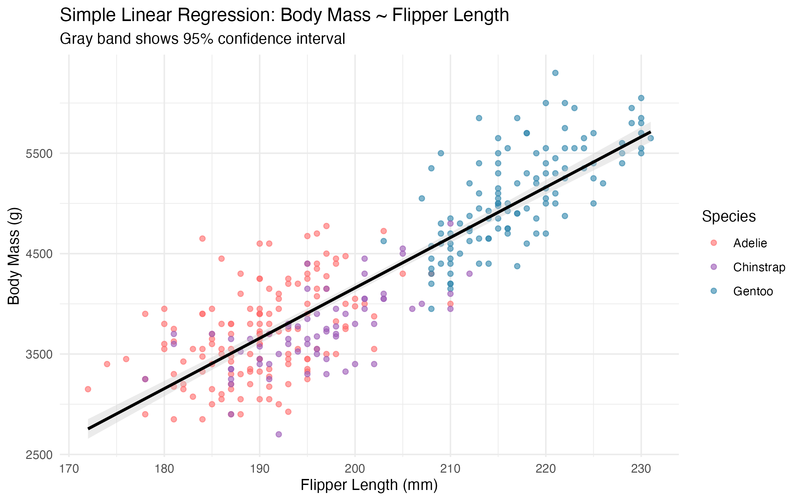
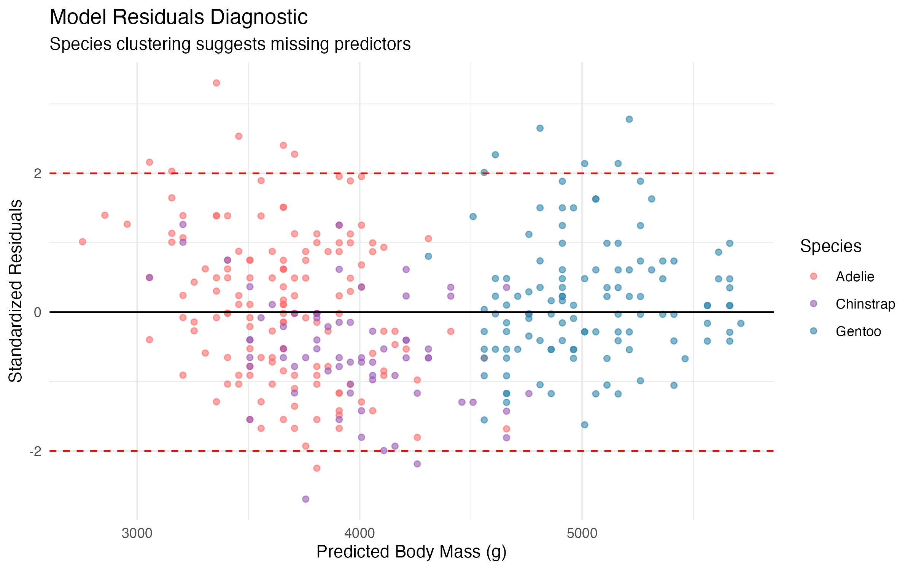

{.img-fluid
width=80%}

*Photo: Antarctic penguins. Licensed under
[CC BY 2.0](https://creativecommons.org/licenses/by/2.0/)
via
[Wikimedia Commons](https://commons.wikimedia.org/).*

# Introduction

How much information can a single flipper
measurement carry? Working with the Palmer
Penguins dataset reveals that one well-chosen
predictor can explain a surprising amount of
variation in body mass, despite initial
assumptions that predicting body mass from
morphometrics would require a complex model.

The Palmer Penguins dataset was collected by
Dr. Kristen Gorman at Palmer Station, Antarctica,
and contains morphometric measurements for three
species: Adelie (*Pygoscelis adeliae*), Chinstrap
(*Pygoscelis antarcticus*), and Gentoo
(*Pygoscelis papua*). It has become a widely used
teaching dataset in the R community, offering a
richer and more realistic alternative to the
classic iris dataset.

This post walks through an initial encounter with
the data, from exploratory analysis to a simple
regression model. The relationship between flipper
length and body mass proves remarkably strong,
though ignoring species differences leaves a lot
on the table.

More formally, this analysis is presented as an instance of
the Project Compendium tier of the Workflow Construct
described in [post 52](/posts/52-workflow-construct/). The
penguins dataset is the construct's reference example; running
it through the zzcollab compendium pattern
(`Dockerfile` + `renv.lock` + `Makefile` + `R/` + `analysis/`)
produces an artefact that another analyst can rebuild
byte-for-byte. The construct-tier post that documents the
compendium pattern itself is
[post 29](/posts/29-setupquarto/); this post is one worked
example of that pattern.

## Motivations

- To practise a complete exploratory data
  analysis workflow on a real biological dataset
  rather than simulated data.
- To examine how well simple morphometric
  measurements can predict body mass without
  any species information.
- To provide a concrete example of Simpson's
  Paradox and why ignoring grouping variables
  can be misleading.
- To demonstrate that working with penguin data
  makes statistics feel more tangible than
  abstract textbook examples.
- To establish a baseline model that subsequent
  posts can improve upon.

## Objectives

1. Load and clean the Palmer Penguins dataset,
   documenting missing values and data quality.
2. Conduct exploratory data analysis with
   summary statistics and visualisations for
   each species.
3. Compute correlations among morphometric
   variables and identify the strongest
   predictor of body mass.
4. Fit a simple linear regression model
   (body mass ~ flipper length), report
   R-squared and confidence intervals, and
   examine residual diagnostics.

Errors and better approaches are welcome; see the
Feedback section at the end.

{.img-fluid}

# Prerequisites and Setup

**Background:** This post assumes familiarity
with basic R syntax and the tidyverse. No prior
knowledge of regression modelling is required.

**Required packages:**

```{r}
#| eval: false
install.packages(
  c("palmerpenguins", "tidyverse", "broom",
    "corrplot", "GGally", "patchwork", "knitr")
)
```

**Load libraries:**

```{r}
library(palmerpenguins)
library(tidyverse)
library(broom)
library(corrplot)
library(GGally)
library(patchwork)
library(knitr)

theme_set(theme_minimal(base_size = 12))

penguin_colors <- c(
  "Adelie"    = "#FF6B6B",
  "Chinstrap" = "#9B59B6",
  "Gentoo"    = "#2E86AB"
)
```

# What Are Morphometrics?

Morphometrics is the quantitative study of
biological form: measuring the size and shape
of organisms. In penguin research, this means
recording bill length, bill depth, flipper
length, and body mass for each individual. These
measurements serve as proxies for overall health
and condition, and they help ecologists monitor
population trends without invasive procedures.

The central question in this post is whether a
single measurement, flipper length, can reliably
predict body mass. If it can, field researchers
gain a quick, non-invasive way to assess penguin
condition.

# Getting Started: Initial Exploration

The analysis begins by loading the data and
checking for missing values. The raw dataset has
344 observations, but some records are incomplete.

```{r}
data(penguins)

cat(
  "Palmer Penguins Dataset Overview\n",
  "================================\n",
  "Dimensions:",
  nrow(penguins), "observations x",
  ncol(penguins), "variables\n"
)

missing_counts <- sapply(
  penguins, function(x) sum(is.na(x))
)
cat(
  "Missing values:",
  sum(missing_counts), "total\n\n"
)

penguins_clean <- penguins |> drop_na()
cat(
  "Clean dataset:",
  nrow(penguins_clean),
  "observations (removed",
  nrow(penguins) - nrow(penguins_clean),
  "incomplete cases)\n\n"
)

glimpse(penguins_clean)
```

After removing incomplete cases, 333 observations
remain across three species. That is a modest but
workable sample for exploratory modelling.

## Species and Morphometric Overview

The three species differ noticeably in both sample
size and average body mass. Gentoo penguins are
considerably larger than Adelie and Chinstrap.

```{r}
species_summary <- penguins_clean |>
  group_by(species) |>
  summarise(
    n = n(),
    body_mass_mean =
      round(mean(body_mass_g), 0),
    flipper_length_mean =
      round(mean(flipper_length_mm), 1),
    .groups = "drop"
  ) |>
  mutate(
    percentage = round(n / sum(n) * 100, 1)
  )

kable(
  species_summary,
  caption = paste(
    "Species Distribution and",
    "Key Morphometrics"
  ),
  col.names = c(
    "Species", "N", "Body Mass (g)",
    "Flipper Length (mm)", "% of Dataset"
  )
)

p_species <- ggplot(
  species_summary,
  aes(x = species, y = n, fill = species)
) +
  geom_col(alpha = 0.8) +
  geom_text(
    aes(
      label = paste0(n, "\n(", percentage, "%)")
    ),
    vjust = -0.5, size = 3.5
  ) +
  scale_fill_manual(values = penguin_colors) +
  labs(
    title = "Species Distribution",
    x = "Species", y = "Count"
  ) +
  theme_minimal() +
  theme(legend.position = "none")

p_relationship <- ggplot(
  penguins_clean,
  aes(
    x = flipper_length_mm,
    y = body_mass_g,
    color = species
  )
) +
  geom_point(alpha = 0.7, size = 1.5) +
  geom_smooth(
    method = "lm", se = FALSE, size = 0.8
  ) +
  scale_color_manual(values = penguin_colors) +
  labs(
    title = "Flipper Length vs Body Mass",
    x = "Flipper Length (mm)",
    y = "Body Mass (g)",
    color = "Species"
  ) +
  theme_minimal()

eda_overview <- p_species + p_relationship
print(eda_overview)

ggsave(
  "eda-overview.png",
  plot = eda_overview,
  width = 10, height = 5, dpi = 300
)
```

```{r}
#| label: fig-eda-overview
#| fig-cap: >
#|   Species distribution and morphometric
#|   relationship overview showing sample
#|   sizes and the key flipper-body mass
#|   relationship across species.
#| fig-alt: >
#|   Two-panel figure: bar chart of species
#|   counts on the left and scatter plot of
#|   flipper length versus body mass on the
#|   right with species-coloured regression
#|   lines.
#| echo: false

```

The scatter plot on the right immediately
suggested a strong positive relationship between
flipper length and body mass, and the three species
clearly occupy somewhat different regions of the
plot.

## Species-Specific Patterns

```{r}
morphometric_summary <- penguins_clean |>
  group_by(species) |>
  summarise(
    n = n(),
    body_mass_mean =
      round(mean(body_mass_g), 0),
    body_mass_ci =
      round(
        1.96 * sd(body_mass_g) / sqrt(n()),
        1
      ),
    flipper_length_mean =
      round(mean(flipper_length_mm), 1),
    flipper_length_ci =
      round(
        1.96 * sd(flipper_length_mm) /
          sqrt(n()),
        1
      ),
    .groups = "drop"
  )

kable(
  morphometric_summary,
  caption = paste(
    "Morphometric Statistics by Species",
    "(plus/minus 95% CI)"
  ),
  col.names = c(
    "Species", "N", "Body Mass (g)",
    "+/- 95% CI",
    "Flipper Length (mm)", "+/- 95% CI"
  )
)

p_comparison <- ggplot(
  penguins_clean,
  aes(x = species, fill = species)
) +
  geom_boxplot(
    aes(y = body_mass_g),
    alpha = 0.7,
    position = position_dodge(0.8)
  ) +
  scale_fill_manual(values = penguin_colors) +
  labs(
    title = paste(
      "Body Mass Distribution by Species"
    ),
    subtitle = paste(
      "Gentoo penguins are notably larger",
      "than Adelie and Chinstrap"
    ),
    x = "Species",
    y = "Body Mass (g)"
  ) +
  theme_minimal() +
  theme(legend.position = "none")

print(p_comparison)
ggsave(
  "species-comparison.png",
  plot = p_comparison,
  width = 8, height = 5, dpi = 300
)
```

```{r}
#| label: fig-species-comparison
#| fig-cap: >
#|   Body mass distributions by species
#|   showing Gentoo penguins are substantially
#|   larger than Adelie and Chinstrap.
#| fig-alt: >
#|   Box plot of body mass by species with
#|   Adelie median around 3750g, Chinstrap
#|   around 3700g, and Gentoo around 5000g.
#| echo: false
knitr::include_graphics(
  "species-comparison.png"
)
```

Gentoo penguins stand out clearly, with a median
body mass roughly 1250g higher than the other two
species. This species-level variation will matter
a great deal when we move to multiple regression
in the next post.

{.img-fluid}

*Stepping back to see the bigger picture.*

## Looking for Relationships

A correlation matrix across the four numeric
morphometric variables identifies which measurement
has the strongest linear association with body
mass.

```{r}
numeric_vars <- penguins_clean |>
  select(
    bill_length_mm, bill_depth_mm,
    flipper_length_mm, body_mass_g
  )

correlation_matrix <- cor(numeric_vars)

body_mass_cors <- correlation_matrix[
  "body_mass_g",
] |>
  sort(decreasing = TRUE) |>
  round(3)

cat(
  "Correlations with Body Mass:\n"
)
cat(sprintf(
  "  Flipper Length: %s (strongest)\n",
  body_mass_cors["flipper_length_mm"]
))
cat(sprintf(
  "  Bill Length: %s\n",
  body_mass_cors["bill_length_mm"]
))
cat(sprintf(
  "  Bill Depth: %s (negative)\n",
  body_mass_cors["bill_depth_mm"]
))

png(
  "correlation-matrix.png",
  width = 6, height = 6,
  res = 300, units = "in"
)
corrplot(
  correlation_matrix,
  method = "color",
  type = "upper",
  order = "hclust",
  tl.cex = 1.0,
  tl.col = "black",
  addCoef.col = "black",
  number.cex = 0.8,
  title = "Morphometric Correlations",
  mar = c(0, 0, 2, 0)
)
dev.off()
```

```{r}
#| label: fig-correlation-matrix
#| fig-cap: >
#|   Correlation matrix showing flipper length
#|   as the strongest predictor of body mass
#|   (r = 0.87).
#| fig-alt: >
#|   Upper triangular correlation matrix with
#|   colour-coded cells and numeric coefficients
#|   for four morphometric variables.
#| echo: false

```

Flipper length emerged as the clear winner, with
a correlation of 0.87 against body mass. This
makes biological sense: longer flippers
correspond to larger birds overall. The negative
correlation with bill depth was initially
surprising, but it reflects the confounding
influence of species (Gentoo penguins have
shallower bills but heavier bodies).

# Building a Model

## Fitting the Simple Regression

With flipper length identified as the strongest
predictor, a simple linear regression model is
appropriate.

```{r}
simple_model <- lm(
  body_mass_g ~ flipper_length_mm,
  data = penguins_clean
)

model_coefficients <- tidy(
  simple_model, conf.int = TRUE
)
model_metrics <- glance(simple_model)

cat("Simple Linear Model Results:\n")
cat("============================\n")
cat(sprintf(
  "R-squared: %.3f (%.1f%% variance explained)\n",
  model_metrics$r.squared,
  model_metrics$r.squared * 100
))
cat(sprintf(
  "RMSE: %.1f grams\n",
  sigma(simple_model)
))
cat(sprintf(
  "F-statistic: %.1f (p < 0.001)\n",
  model_metrics$statistic
))

intercept <- model_coefficients$estimate[1]
slope <- model_coefficients$estimate[2]
slope_ci_lower <- model_coefficients$conf.low[2]
slope_ci_upper <- model_coefficients$conf.high[2]

cat("\nModel Equation:\n")
cat(sprintf(
  "Body Mass = %.1f + %.1f x Flipper Length\n",
  intercept, slope
))
cat(sprintf(
  "Slope 95%% CI: [%.1f, %.1f] grams/mm\n",
  slope_ci_lower, slope_ci_upper
))
```

An R-squared of 0.76 indicates that flipper length
alone accounts for about three-quarters of the
variation in body mass. That is a surprisingly
strong result for a single predictor.

## Making Predictions

To make the model concrete, predictions for three
representative flipper lengths with 95% confidence
intervals are generated.

```{r}
new_data <- tibble(
  flipper_length_mm = c(180, 200, 220)
)
predictions <- predict(
  simple_model,
  newdata = new_data,
  interval = "confidence"
)

cat("Example Predictions (95% CI):\n")
for (i in 1:nrow(new_data)) {
  cat(sprintf(
    "  %dmm flippers: %.0f g [%.0f, %.0f]\n",
    new_data$flipper_length_mm[i],
    predictions[i, "fit"],
    predictions[i, "lwr"],
    predictions[i, "upr"]
  ))
}
```

The confidence intervals are reasonably narrow,
which is encouraging. A penguin with 200mm
flippers would be predicted to weigh roughly
4200g, give or take a few hundred grams.

```{r}
model_plot <- ggplot(
  penguins_clean,
  aes(x = flipper_length_mm, y = body_mass_g)
) +
  geom_point(
    aes(color = species), alpha = 0.6
  ) +
  geom_smooth(
    method = "lm",
    color = "black",
    fill = "gray80"
  ) +
  scale_color_manual(values = penguin_colors) +
  labs(
    title = paste(
      "Simple Linear Regression:",
      "Body Mass ~ Flipper Length"
    ),
    subtitle = paste(
      "Gray band shows 95%",
      "confidence interval"
    ),
    x = "Flipper Length (mm)",
    y = "Body Mass (g)",
    color = "Species"
  ) +
  theme_minimal()

print(model_plot)
ggsave(
  "simple-regression-model.png",
  plot = model_plot,
  width = 8, height = 5, dpi = 300
)
```

```{r}
#| label: fig-simple-regression
#| fig-cap: >
#|   Simple linear regression of body mass on
#|   flipper length with 95% confidence band.
#| fig-alt: >
#|   Scatter plot with regression line showing
#|   positive relationship between flipper
#|   length and body mass, with gray confidence
#|   band and species-coloured points.
#| echo: false

```

# Checking Our Work

Before drawing conclusions, examining the residuals
reveals whether the model assumptions hold.

```{r}
penguins_with_predictions <- penguins_clean |>
  mutate(
    predicted = predict(simple_model),
    residuals = residuals(simple_model),
    standardized_residuals =
      rstandard(simple_model)
  )

outliers <- which(
  abs(
    penguins_with_predictions$standardized_residuals
  ) > 2.5
)
cat("Model Assumption Checks:\n")
cat(sprintf(
  "  Potential outliers: %d (>2.5 SD)\n",
  length(outliers)
))
cat(sprintf(
  "  Residual standard error: %.1f grams\n",
  sigma(simple_model)
))

diagnostic_plot <- ggplot(
  penguins_with_predictions,
  aes(
    x = predicted,
    y = standardized_residuals
  )
) +
  geom_point(
    aes(color = species), alpha = 0.6
  ) +
  geom_hline(
    yintercept = c(-2, 0, 2),
    linetype = c("dashed", "solid", "dashed"),
    color = c("red", "black", "red")
  ) +
  scale_color_manual(values = penguin_colors) +
  labs(
    title = "Model Residuals Diagnostic",
    subtitle = paste(
      "Species clustering suggests",
      "missing predictors"
    ),
    x = "Predicted Body Mass (g)",
    y = "Standardized Residuals",
    color = "Species"
  ) +
  theme_minimal()

print(diagnostic_plot)
ggsave(
  "model-diagnostics.png",
  plot = diagnostic_plot,
  width = 8, height = 5, dpi = 300
)
```

```{r}
#| label: fig-diagnostics
#| fig-cap: >
#|   Residual plot showing species clustering,
#|   indicating the model is missing important
#|   predictors.
#| fig-alt: >
#|   Scatter plot of standardized residuals
#|   versus predicted values with points
#|   coloured by species, showing distinct
#|   clustering patterns.
#| echo: false

```

The residual plot reveals a clear pattern: the
three species form distinct clusters. This
indicates that the simple model, while useful, is
leaving systematic variation on the table. Species
identity clearly matters, and ignoring it
introduces bias into the predictions.

## Things to Watch Out For

1. **Simpson's Paradox is real.** Ignoring species
   can reverse or obscure the true relationship
   between variables. Always check for grouping
   structure.
2. **Missing data is not random.** The 11
   incomplete cases dropped may not be missing at
   random. It is worth investigating why
   measurements were missing before assuming
   complete-case analysis is safe.
3. **Correlation is not slope.** A correlation of
   0.87 sounds high, but the RMSE of 393g means
   individual predictions can be off by quite
   a bit.
4. **Extrapolation is dangerous.** The model is
   only valid within the observed flipper length
   range (172-231mm). Predictions outside this
   range are unreliable.
5. **Residual patterns demand attention.** When
   residuals cluster by group, the model is
   telling you something important is missing.

{.img-fluid}

*Pausing to reflect before drawing conclusions.*

# What Did We Learn?

## Lessons Learnt

**Conceptual Understanding:**

- Flipper length alone explains 76.2% of body
  mass variance (R-squared = 0.762), which is
  a remarkably strong single-predictor result
  in biological data.
- Species-level differences are substantial:
  Gentoo penguins average roughly 5000g
  compared to approximately 3700g for Adelie
  and Chinstrap.
- The negative correlation between bill depth
  and body mass (r = -0.47) is a classic
  example of confounding by species, not a
  true biological relationship.
- Confidence intervals around the slope
  (approximately 46-54 grams per mm of flipper
  length) are narrow enough to be practically
  useful for field estimation.

### Technical Skills

- Using `broom::tidy()` and `broom::glance()`
  produces tidy model summaries that integrate
  cleanly into a tidyverse workflow.
- `corrplot` provides a quick visual summary of
  multivariate relationships that is easier to
  scan than a numeric matrix.
- Combining `patchwork` with `ggplot2` enables
  side-by-side panel figures without wrestling
  with `par(mfrow)` or grid graphics.
- The `predict()` function with
  `interval = "confidence"` gives immediate
  access to uncertainty quantification for new
  observations.

### Gotchas and Pitfalls

- Dropping `NA` rows silently can change
  species proportions; always report how many
  cases were removed and from which groups.
- The default `geom_smooth(method = "lm")`
  plots a confidence band for the mean, not a
  prediction interval; these are different and
  should not be confused.
- Saving a plot with `ggsave()` and then
  including it with `include_graphics()` can
  produce slightly different dimensions than
  the inline rendering; set explicit width and
  height to ensure consistency.
- Colour palettes that look fine on screen may
  not be distinguishable in greyscale or to
  colour-blind readers; always use shape or
  linetype as a secondary encoding.

## Limitations

- The dataset contains only 333 complete
  observations across three species, which
  limits the complexity of models that can be
  reliably estimated.
- Data were collected between 2007 and 2009 at
  a single Antarctic station; climate and
  environmental conditions may have changed
  since then.
- The simple model treats all species as a
  homogeneous population, which the residual
  analysis clearly shows is inappropriate.
- Measurement error in morphometric variables
  is not accounted for in the model.
- Sex is available in the data but was not
  included in this initial analysis; it may
  explain additional variance.
- The causal direction is assumed (flipper
  length predicts mass), but both variables are
  expressions of overall body size.

## Opportunities for Improvement

1. Add species as a categorical predictor to
   account for the between-species variance
   visible in the residuals.
2. Include bill length and bill depth as
   additional predictors in a multiple
   regression framework.
3. Explore interaction terms between species
   and flipper length to allow different slopes
   per species.
4. Use cross-validation to assess out-of-sample
   prediction accuracy rather than relying
   solely on in-sample R-squared.
5. Compare linear models to non-parametric
   approaches such as random forests to see
   whether the linear assumption is costing
   predictive accuracy.
6. Investigate the missing data mechanism before
   dropping incomplete cases.

# Wrapping Up

This first exploration of the Palmer Penguins
dataset revealed that flipper length is a
remarkably strong predictor of body mass, but
that ignoring species differences leaves
substantial room for improvement.

Even a simple regression model can tell a
compelling story when paired with careful
diagnostic checks. The residual clustering by
species was the most instructive finding: it
shows exactly where the model falls short and
points directly toward the next analytical step.

For analysts working through this kind of
analysis, the advice is to always plot the
residuals and look for structure. The numbers
alone (R-squared, p-values) do not tell the
whole story.

**Main takeaways:**

- Flipper length explains 76.2% of body mass
  variance (R-squared = 0.762).
- RMSE of approximately 393g provides a
  practical measure of prediction accuracy.
- Species clustering in residuals indicates the
  model is missing a key predictor.
- Adding species information in Part 2 will
  improve R-squared to over 0.860.

# See Also

**Related posts in this series:**

- Part 2: Multiple Regression and Species
  Effects
- Part 3: Advanced Models and Cross-Validation
- Part 4: Model Diagnostics and Interpretation
- Part 5: Random Forest vs Linear Models

**Key resources:**

- [Palmer Penguins R Package](https://allisonhorst.github.io/palmerpenguins/) --
  official documentation and vignettes
- [R for Data Science (2e)](https://r4ds.hadley.nz/) --
  Wickham, Cetinkaya-Rundel, and Grolemund
- [Introduction to Statistical Learning](https://www.statlearning.com/) --
  James, Witten, Hastie, and Tibshirani
- [Tidy Modeling with R](https://www.tmwr.org/) --
  Kuhn and Silge

# Reproducibility

**Data source:** The `palmerpenguins` R package
(version 0.1.1), which provides the `penguins`
dataset collected by Dr. Kristen Gorman at Palmer
Station, Antarctica.

**Analysis pipeline:**

```bash
Rscript analysis/scripts/01_prepare_data.R
Rscript analysis/scripts/02_fit_models.R
Rscript analysis/scripts/03_generate_figures.R
quarto render index.qmd
```

**Session information:**

```{r}
#| echo: false
sessionInfo()
```

# Let's Connect

*Have questions, suggestions, or spot an error? Let me know.*

- **GitHub:** [rgt47](https://github.com/rgt47)
- **Twitter/X:** [@rgt47](https://twitter.com/rgt47)
- **LinkedIn:** [Ronald Glenn Thomas](https://linkedin.com/in/rgthomaslab)
- **Email:** [Contact form](https://rgtlab.org/contact)

I would enjoy hearing from you if:

- You spot an error or a better approach to any of the
  code in this post.
- You have suggestions for topics you would like to see
  covered.
- You want to discuss R programming, data science, or
  reproducible research.
- You have questions about anything in this tutorial.
- You just want to say hello and connect.
